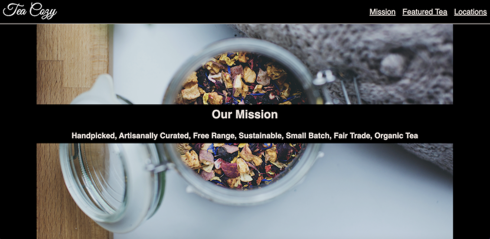

# Tea Cozy

**_View this project_**: [https://friendly-palmier-bd2942.netlify.app/](https://friendly-palmier-bd2942.netlify.app/)

## Description

Student project for Codecademy Full Stack Path.

**_Learning objective_**: To build a "pexel-perfect," responsive website based on the design spec provided. This project simulates the teamwork and division of labor involved in a professional collaboration between a UX/UI designer and me as the developer. At the same time, it showcases the self-directedness that comes with greater experience and competence in HTML, CSS, and a professional development workflow.

## Features

#### HTML

- Logically organized semantic HTML, conscientiously coded with accessibility concerns in mind

- HTML elements: html, head, meta, link, title, body, nav, header, main, section, footer, h1, h2, h3, h4, h5, p, ul, li, a, img, div

- HTML attributes: alt, class, href, rel, src, title

#### CSS

- Responsive CSS, including responsive navigation, responsive images, and advanced techniques such as flexbox and media queries

- CSS properties: align-items, background-color, background-image, background-position, background-size, background-repeat, border-bottom, color, display, flex-direction, flex-wrap, font-family, font-size, height, justify-content, left, line-height, list-style, margin, max-width, opacity, padding, position, text-align, top, width

#### Accessibility, Design, & Workflow Considerations

- Includes client's media assets (images and logo) and follows a mock-professional design spec for a "pexel-perfect" reproduction, thereby simulating a professional collaboration with a UX/UI designer

- Accessibility score from Lighthouse audit: 96/100 for desktops and 96/100 for mobile devices. The report flagged the following: "Heading elements are not in a sequentially-descending order." This problem arises from how the author of the design spec labeled the heading elements. Further, since the designer neglected to include an h1, which is required by modern browsers for SEO purposes and more, I converted the name of the website at the bottom of the page to an h1. In a real professional setting with a situation like this, I would communicate the problem to the designer and proceed to properly sequence the heading elements. I believe these considerations (and conversations) are fundamental to responsible, conscientious, 21st-century web design and development.

- Skilled use of Google Chrome's DevTools for debugging and prototyping changes in the browser. The toggle device tools were especially useful for testing the responsiveness of my code on devices of different sizes.

- Coded in VS Code using professional development workflow tools such as Live Server and GitHub Desktop, with hosting on Netlify, implementing a process of continuous deployment

- Includes this polished README, written using Markdown

## Design Spec

## Project Preview

